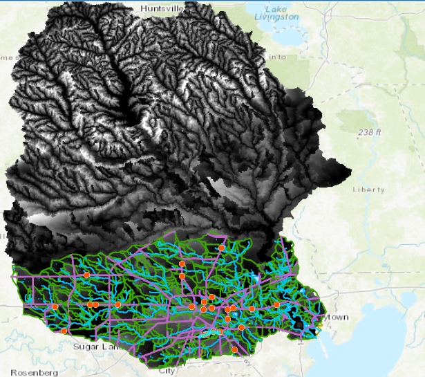

## Description
This project includes scripts for geospatial analysis!
* `getNWMdata.py`: This script uses the hydroshare API to extract [National Water Model](https://water.noaa.gov/about/nwm) short-range data for hurricane Harvey; importantly, it subsets the continental-scale data to catchment IDs within the Houston watershed (reduce dataset size from 2,716,897 reaches to the number of reaches in the specified area). The data is then saved as a netcdf file.

*  `processNWMdata.py`: For each road element in the ArcGIS roads feature class, finds the NWM forecasts of the overlapping catchments (from `getNWMdata.py`), and assigns the *maximum* streamflow to the **NWM** attribute in the roads layer.

* `computeRoadHand.py`: Height above nearest drainage (HAND) data extracted from the [national flood interoperability experiment](https://web.corral.tacc.utexas.edu/nfiedata/) is used to find the *minimum* HAND value for each road segment. A point layer representation of the road network is needed for those methods. 

* `discharge2stage.py`: Data from [national flood interoperability experiment](https://web.corral.tacc.utexas.edu/nfiedata/) gives HAND-derived rating curves as discharge-stage data points. This module uses piecewise-linear interpolation to extract the stage height for any discharge value. The module also includes methods for computing the inundation as stage minus HAND and for writing values to ArcGIS layers.

* `process-roads.py`: Cleans the road layer by identifying duplicate elements that belong to multiple catchments.

